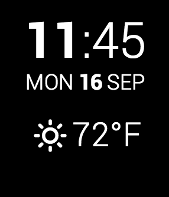

# DashPebble
A Pebble watch face modeled after DashClock for Android.

# Installation
Currently, you have to build the project yourself. Follow [Pebble Developer](http://developer.getpebble.com/) instructions for building and installing apps onto your pebble.

## License
Licenced under the [MIT License](http://www.opensource.org/licenses/mit-license.php)

